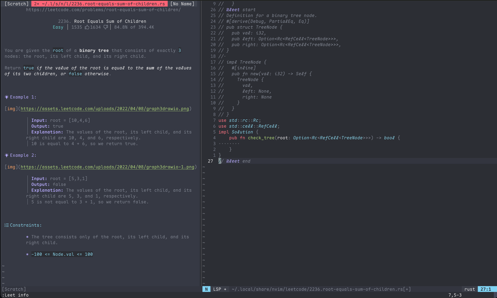

# LeetCode Rust Workspace

A Rust workspace for organizing and syncing LeetCode solutions.

## Project Structure

```
leetcodes/
├── Cargo.toml           # Project config + dependencies
├── .env                 # LeetCode cookies (gitignored)
├── .env.example         # Template for .env
├── .gitignore
└── src/
    ├── lib.rs           # Declares Solution struct + all modules
    ├── main.rs          # Test runner
    ├── bin/
    │   └── sync.rs      # Auto-sync tool (fetches from LeetCode API)
    ├── p704_binary_search.rs
    ├── p35_search_insert_position.rs
    └── ...
```

## How It Works

### Module System

```
┌─────────────────────┐
│       lib.rs        │  ← Crate root (library)
│                     │
│  pub struct Solution│  ← Shared struct
│  pub mod p704_...;  │  ← Declares modules
│  pub mod p35_...;   │
└─────────────────────┘
          ▲
          │ use crate::Solution;
          │
┌─────────────────────┐
│  p704_binary_search │  ← Solution file
│                     │
│  impl Solution {    │
│    pub fn search()  │
│  }                  │
└─────────────────────┘
          ▲
          │ use leetcodes::Solution;
          │
┌─────────────────────┐
│      main.rs        │  ← Binary (test runner)
│                     │
│  fn main() {        │
│    Solution::search │
│  }                  │
└─────────────────────┘
```

### Key Concepts

| Term | What it is |
|------|------------|
| `crate` | Compilation unit (library or binary) |
| `lib.rs` | Library crate root |
| `main.rs` | Binary crate (separate from lib) |
| `use crate::` | Import from lib.rs (inside library) |
| `use leetcodes::` | Import from lib.rs (from main.rs) |

## Commands

| Task | Command |
|------|---------|
| Sync from LeetCode | `cargo run --bin sync` |
| Build all | `cargo build` |
| Run main | `cargo run` |

## Sync Tool Setup

### 1. Get LeetCode Cookies

1. Go to https://leetcode.com and log in
2. Open DevTools: `Cmd+Option+I` (Mac) or `F12` (Windows)
3. Go to **Application** → **Cookies** → `leetcode.com`
4. Copy values for:
   - `LEETCODE_SESSION`
   - `csrftoken`

### 2. Create .env File

```bash
cp .env.example .env
```

Edit `.env`:
```
LEETCODE_SESSION=eyJhbGciOiJIUzI1NiIsInR5cCI6IkpXVCJ9...
CSRF_TOKEN=abc123xyz...
LEETCODE_USERNAME=YourUsername
```

### 3. Run Sync

```bash
cargo run --bin sync
```

This will:
- Fetch your last 50 submissions from LeetCode
- Filter for **Accepted** + **Rust** only
- Create `src/p{number}_{name}.rs` files
- Update `lib.rs` with new modules

## Adding Solutions Manually

### Step 1: Create file `src/p123_problem_name.rs`

```rust
use crate::Solution;

impl Solution {
    pub fn your_function() -> i32 {
        // paste LeetCode code here
    }
}
```

### Step 2: Register in `src/lib.rs`

```rust
pub mod p123_problem_name;
```

### Step 3: Test in `src/main.rs` (optional)

```rust
use leetcodes::Solution;

fn main() {
    let result = Solution::your_function();
    println!("{:?}", result);
}
```

## File Naming Convention

```
p{problem_number}_{problem_slug}.rs

Examples:
- p704_binary_search.rs
- p35_search_insert_position.rs
- p2469_convert_the_temperature.rs
```

The `p` prefix is required because Rust identifiers cannot start with numbers.

## GitHub Repository

https://github.com/baily-zhang/leetcode-rust

## Dependencies

```toml
[dependencies]
reqwest = { version = "0.12", features = ["json"] }
tokio = { version = "1", features = ["full"] }
serde = { version = "1", features = ["derive"] }
serde_json = "1"
dotenvy = "0.15"
```

## Synced Solutions

| # | Problem | File |
|---|---------|------|
| 704 | Binary Search | `p704_binary_search.rs` |
| 35 | Search Insert Position | `p35_search_insert_position.rs` |
| 34 | Find First and Last Position | `p34_find_first_and_last_position_of_element_in_sorted_array.rs` |
| 2469 | Convert the Temperature | `p2469_convert_the_temperature.rs` |
| 2413 | Smallest Even Multiple | `p2413_smallest_even_multiple.rs` |
| 2235 | Add Two Integers | `p2235_add_two_integers.rs` |

## Neovim + leetcode.nvim Integration

You can also solve LeetCode problems directly in Neovim using [leetcode.nvim](https://github.com/kawre/leetcode.nvim).



### Complete Workflow

```
┌─────────────────────────────────────────────────────────────────┐
│                        WORKFLOW                                 │
├─────────────────────────────────────────────────────────────────┤
│                                                                 │
│  1. SOLVE in Neovim                                             │
│     ┌──────────────┐                                            │
│     │  :Leet       │  ← Pick a problem                          │
│     │  Write code  │  ← LSP + autocomplete                      │
│     │  :Leet run   │  ← Test locally                            │
│     │  :Leet submit│  ← Submit to LeetCode                      │
│     └──────────────┘                                            │
│            │                                                    │
│            ▼                                                    │
│  2. SUBMIT to LeetCode.com                                      │
│     ┌──────────────┐                                            │
│     │  ✓ Accepted  │  ← Stored on LeetCode servers              │
│     └──────────────┘                                            │
│            │                                                    │
│            ▼                                                    │
│  3. SYNC to local repo                                          │
│     ┌────────────────────────┐                                  │
│     │  cargo run --bin sync  │  ← Fetches from LeetCode API     │
│     └────────────────────────┘                                  │
│            │                                                    │
│            ▼                                                    │
│  4. FILES created in src/                                       │
│     ┌──────────────────────────┐                                │
│     │  src/p704_binary_search.rs│                               │
│     │  src/p35_search_insert... │                               │
│     └──────────────────────────┘                                │
│            │                                                    │
│            ▼                                                    │
│  5. COMMIT & PUSH to GitHub                                     │
│     ┌──────────────┐                                            │
│     │  git add .   │                                            │
│     │  git commit  │                                            │
│     │  git push    │                                            │
│     └──────────────┘                                            │
│                                                                 │
└─────────────────────────────────────────────────────────────────┘
```

### Neovim Commands

| Command | Action |
|---------|--------|
| `:Leet` | Open problem list |
| `:Leet run` | Run test cases |
| `:Leet submit` | Submit solution |
| `:Leet lang rust` | Set language to Rust |

### Panel Layout

- **Left panel**: Problem description with examples and constraints
- **Right panel**: Code editor with LSP support
- Use `@leet` markers in code:
  - `// @leet start` - Begin solution
  - `// @leet end` - End solution
